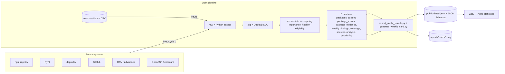

# The Bus Factor

A **Bruin-powered** weekly snapshot of open-source package continuity fragility for **npm** and **PyPI**.

> Which widely depended-on packages look structurally fragile this week, and what evidence supports that?

Built for the [Bruin Data Engineering Project Competition](https://getbruin.com) — deadline **June 1, 2026, 12:00 UTC**.

---

## Status

- **Cycle 1 — complete.** Fixture-backed pipeline + static showcase. The full graph (seeds → raw → staging → intermediate → marts → public export → weekly card) runs end-to-end on DuckDB with zero API keys.
- **Cycle 2 — in progress.** Live BigQuery-backed ingestion of the ten public sources on top of the same asset graph.
- Cycle 3 captures the canonical Bruin AI Data Analyst screenshots and ships the launch package.

Live status tracker: [`docs/progress.md`](docs/progress.md).

## Architecture



Every weight, threshold, and exclusion rule lives in a single file: `pipeline/config/scoring.yml`. Frontend and exports read marts — they never re-derive scores.

## Quickstart

> You need Python 3.12, Node 24 LTS, and a shell that can run `curl`. The setup script installs everything else.

```bash
./scripts/setup.sh           # Bruin CLI + uv + fnm + pnpm
uv sync --locked
pnpm install
cp .bruin.yml.example .bruin.yml

bruin validate pipeline/pipeline.yml
bruin run --workers=1 --full-refresh -e fixture pipeline/pipeline.yml

# Optional: preview the site against the freshly exported bundle
pnpm --filter ./web build
pnpm --filter ./web preview
```

The fixture run is deterministic: the same CSVs in `pipeline/fixtures/` always produce the same `public-data/` bundle and weekly card, so CI can validate structural invariants via [`tests/test_schemas.py`](tests/test_schemas.py) and custom SQL checks on every PR.

### Run live sources

The same DAG runs against BigQuery + the ten public sources documented in
[`docs/sources.md`](docs/sources.md) when `source_mode=live`. Local dev
uses Google Application Default Credentials; CI uses a service-account
JSON via GitHub Actions secrets. See
[`.bruin.yml.example`](.bruin.yml.example) for both connection shapes.

**One-time setup (local)**

```bash
gcloud auth application-default login --account <your-account>
gcloud config set project bus-factor-494119

export GITHUB_INGEST_TOKEN=ghp_...           # read-only PAT; lifts REST cap from 60/hr to 5000/hr
export BQ_MAX_BYTES_BILLED=10000000000       # 10 GB guardrail per BigQuery job (optional; default is applied in code)
```

**Refresh the universe seed (cold path, monthly)**

The weekly hot path reads the top-N package list from committed JSON
seeds under [`pipeline/data/universe/`](pipeline/data/universe). The
expensive deps.dev BigQuery lookup only runs when an operator refreshes
those seeds:

```bash
python scripts/refresh_universe.py --ecosystem pypi --limit 500                  # free (HTTP only)
python scripts/refresh_universe.py --ecosystem npm  --limit 500                  # ~450 GB BigQuery scan
python scripts/refresh_universe.py --ecosystem npm  --limit 500 --bootstrap      # free HTTP fallback for initial commit
```

**Run the weekly pipeline against live sources**

```bash
bruin run --workers=1 --full-refresh -e local_live_bq \
  --var 'source_mode="live"' --var 'warehouse="bigquery"' \
  --var npm_package_limit=500 --var pypi_package_limit=500 \
  pipeline/pipeline.yml
```

At 500/500 the full live run issues ~10k–30k authenticated HTTP requests
(npm + PyPI registry, deps.dev via seed, OSV, GitHub REST+GraphQL,
OpenSSF Scorecard REST) and zero BigQuery jobs. Expect 20–40 min
wall-clock depending on network. The resulting `public-data/` bundle
(capped at 25 MB) and `reports/cards/latest.png` can be committed like
any fixture snapshot; `mart.source_health` must list all ten sources
with fresh `last_success_at` timestamps.

Cycle 2 validates BigQuery with a second smoke step that uploads the
live run's `seed` and `raw` DuckDB tables, renders the BigQuery SQL
siblings, and writes prefixed BigQuery datasets:

```bash
uv run python scripts/run_bigquery_smoke.py \
  --duckdb-path data/local_live_bq.duckdb \
  --project-id bus-factor-494119 \
  --location US \
  --dataset-prefix bf_smoke
```

That command writes `bf_smoke_raw`, `bf_smoke_stg`, `bf_smoke_int`, and
`bf_smoke_mart` in BigQuery and fails if the mart custom checks or
`bf_smoke_mart.source_health` are unhealthy.

### Pre-commit checklist

```bash
uv run ruff format --check . && uv run ruff check . && uv run mypy pipeline && uv run pytest
bruin validate pipeline/pipeline.yml
bruin run --workers=1 --full-refresh -e fixture pipeline/pipeline.yml
cd web && pnpm lint && pnpm typecheck && pnpm build
```

## Bruin features this project exercises

| Bruin feature | Where it lives | Why it matters |
| --- | --- | --- |
| DuckDB + BigQuery dual warehouse | [`pipeline/pipeline.yml`](pipeline/pipeline.yml) · [`.bruin.yml.example`](.bruin.yml.example) | Same asset graph runs on a committed DuckDB fixture and BigQuery live data (toggled by `source_mode`). |
| Seed assets | [`pipeline/assets/seeds/`](pipeline/assets/seeds) | Fourteen CSV fixtures declared with typed columns and inline checks (`not_null`, `unique`, `accepted_values`). |
| Python assets | [`pipeline/assets/raw/`](pipeline/assets/raw) · [`pipeline/assets/marts/export_public_bundle.py`](pipeline/assets/marts/export_public_bundle.py) · [`pipeline/assets/marts/generate_weekly_card.py`](pipeline/assets/marts/generate_weekly_card.py) | Ingestion, JSON export (via Pydantic), and the Pillow share card all live inside the DAG. |
| SQL assets (staging, intermediate, marts) | [`pipeline/assets/staging/`](pipeline/assets/staging) · [`pipeline/assets/intermediate/`](pipeline/assets/intermediate) · [`pipeline/assets/marts/`](pipeline/assets/marts) | ANSI-friendly DuckDB SQL portable to BigQuery, parameterised by Bruin variables. |
| Column-level metadata + built-in checks | every asset | Documents the contract and enforces quality inline. |
| Custom SQL checks | `custom_checks:` in mart frontmatter | Encodes "no flagged + low confidence", fragility-evidence count, score bounds, and known-state agreement. |
| Variables | `pipeline/pipeline.yml` + `{{ var('...') }}` | `source_mode`, `warehouse`, `snapshot_week`, and package-limit knobs are all first-class Bruin variables. |
| Scheduling | `pipeline/pipeline.yml` | Declared weekly schedule; GitHub Actions hooks into the same entry point. |
| Lineage + AI context | `bruin validate` in [`.github/workflows/ci.yml`](.github/workflows/ci.yml) | Lineage-aware validation on every PR; the AI Data Analyst sees the same DAG described in the repo. |

## Repo map

| Path | What it is |
| --- | --- |
| [`docs/init.md`](docs/init.md) | Authoritative project spec. All decisions live here. |
| [`AGENTS.md`](AGENTS.md) / [`CLAUDE.md`](CLAUDE.md) | Baseline context for AI coding agents. |
| [`pipeline/`](pipeline) | Bruin pipeline: assets, config, fixtures, shared Python helpers. |
| [`pipeline/config/scoring.yml`](pipeline/config/scoring.yml) | **Single source of truth** for all weights and thresholds. |
| [`pipeline/lib/`](pipeline/lib) | Pure-Python helpers (config loader, scoring mirror, schemas, snapshot clock). |
| [`public-data/`](public-data) | JSON bundle exported by the pipeline, consumed by the site. |
| [`web/`](web) | Astro static showcase. Reads only `public-data/` + JSON Schemas. |
| [`analysis/`](analysis) | Canonical Bruin AI Data Analyst prompts + screenshot assets. |
| [`reports/`](reports) | Weekly narrative + share cards. |
| [`launch/`](launch) | Slack post, LinkedIn post, comparison tables, submission checklist. |
| [`docs/`](docs) | Methodology, sources, and the full spec. |
| [`tests/`](tests) | Python tests (config, snapshot, scoring, schemas, public-data validation). |

## Competitive positioning

| Category | Example tools | Primary question answered | Relationship to The Bus Factor |
| --- | --- | --- | --- |
| Software-composition analysis (SCA) | Snyk, Sonatype, Endor Labs, Socket | Does **my application** include a vulnerable or untrusted dependency? | Complementary. SCA tools scan your manifest; we characterise the upstream ecosystem irrespective of any manifest. |
| Supply-chain malware scanners | Socket, Phylum, Checkmarx | Is **this specific version** malicious or typo-squatting? | Orthogonal. We never classify packages as malicious — only structurally fragile, with evidence. |
| Repository health scorecards | OpenSSF Scorecard, deps.dev | How does **this repository** score on best-practice heuristics? | We consume Scorecard as one of six fragility signals and weight it at 10%. |
| Dependency graph explorers | deps.dev, Libraries.io | What depends on **X**? | We use the same data to compute dependency reach as an importance input. |
| Ecosystem intelligence reports | Sonatype State of the Supply Chain, Endor research | What are the **broad trends** in open-source risk? | Closest peer. We publish a reproducible, weekly, package-level dataset instead of a quarterly PDF. |
| The Bus Factor | — | Which **widely depended-on** packages show structural fragility signals this week, and what evidence supports that? | This project. |

More detail in [`launch/comparison-tables.md`](launch/comparison-tables.md) and [`docs/init.md`](docs/init.md) §"Competitive positioning".

## What this is (and isn't)

**Is**: a public, reproducible "importance × continuity fragility" dataset for widely used packages, built with Bruin and explained through a static showcase plus Bruin AI Data Analyst examples.

**Isn't**: a replacement for Snyk/Sonatype/Endor/Socket, a malware detector, a definitive abandoned-package classifier, or a custom NL/chat interface. We don't label any package as abandoned, dead, or negligent; we surface *evidence of fragility signals*. Maintainer names never appear on viral surfaces.

## License

MIT (TBD).
