# The Bus Factor

**Which widely depended-on open-source packages show structural fragility signals this week — and what's the evidence?**

A Bruin-powered weekly data product that scores the **250 most-depended-on npm packages** (ranked by distinct direct dependents via `bigquery-public-data.deps_dev_v1`) and the **250 most-downloaded PyPI packages** (ranked by 90-day downloads via [hugovk/top-pypi-packages](https://github.com/hugovk/top-pypi-packages)) on **importance × continuity fragility**, publishes a static leaderboard, and lets you interrogate the dataset with AI.

**[Live demo →](https://josephwibowo.github.io/the-bus-factor)** · **[Analysis gallery →](https://josephwibowo.github.io/the-bus-factor/analysis)** · **[Weekly report →](https://josephwibowo.github.io/the-bus-factor/weekly/)**

---


---

## What it does

Every Monday the pipeline:

1. Ingests fresh data from **6 public sources** — npm, PyPI, GitHub, deps.dev, OSV advisories, and OpenSSF Scorecard
2. Scores every package on two axes: **importance** (how much of the ecosystem depends on it) and **fragility** (how many maintenance signals look stressed)
3. Flags packages that clear a conservative, multi-signal gate — high importance, medium-or-higher confidence, and at least **two independent fragility signals**
4. Exports a static JSON bundle and publishes a shareable weekly card

The result is a reproducible, public dataset that answers a question no SCA tool answers: not "is this in my app?" but "which widely used packages look structurally fragile **right now**, across the whole ecosystem?"

---

## Scoring model (v0.3.0)

All weights and thresholds live in one file: [`pipeline/config/scoring.yml`](pipeline/config/scoring.yml). Nothing is hardcoded.

**Importance** — ecosystem-relative percentile, weights:
- Dependency reach (deps.dev downstream dependents) — **60%**
- Download volume (90-day registry downloads) — **25%**
- Security exposure (OSV transitive vulnerability count) — **15%**

When dependency reach is unavailable for an ecosystem/package (currently common
for PyPI), the missing component stays unknown and the available importance
signals are reweighted. Unknown reach is never treated as zero reach.

**Fragility** — ecosystem-relative percentile, weights:
- Release recency — **25%**
- Commit recency — **25%**
- Release cadence decay — **15%**
- Issue responsiveness — **15%**
- Contributor bus factor — **10%**
- OpenSSF Scorecard — **10%**

A package is **flagged** only when it clears all four gates simultaneously: top-25% importance, risk score ≥ 30, medium-or-higher confidence, and at least two signals each contributing ≥ 40%. That conservatism is intentional — false positives cost more than false negatives on a public surface.

Live snapshots publish only after source-health checks pass; stale or degraded
critical sources block the weekly bundle rather than quietly lowering scores.

---

## Bruin AI Data Analyst

The dataset is built to be interrogated. Below are the eight canonical questions answered by Bruin AI Data Analyst directly over the pipeline's mart tables — no custom chat interface, no post-processing.

> These captures will be replaced with live Bruin MCP screenshots after the next full live run.

**Q1 — Which flagged npm packages have the highest risk score, and what evidence explains each score?**

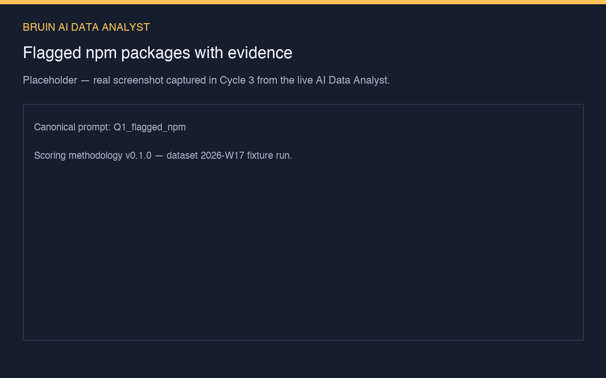

**Q2 — Which flagged PyPI packages have the highest risk score?**

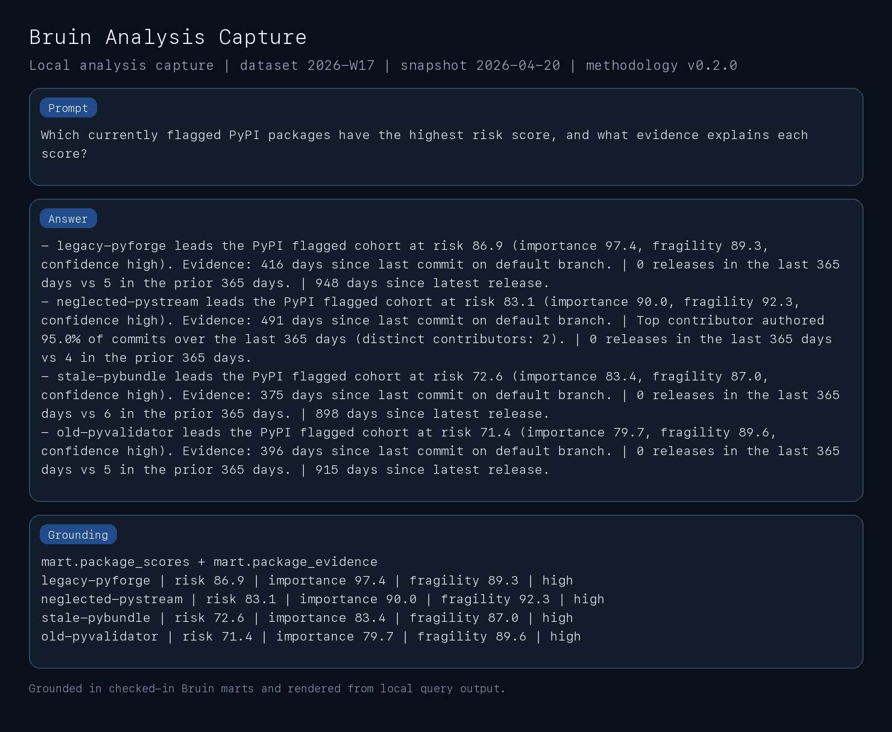

**Q3 — Group the flagged packages by ecosystem and severity tier.**

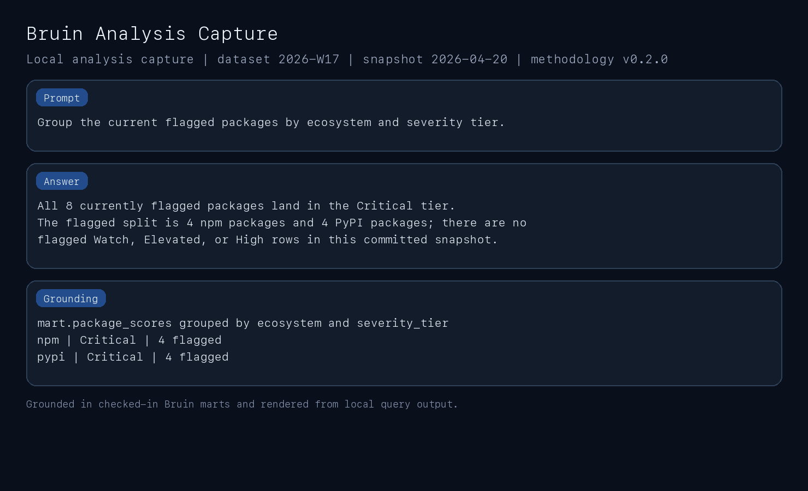

**Q4 — Which high-importance packages have elevated fragility signals but are not flagged, and why?**

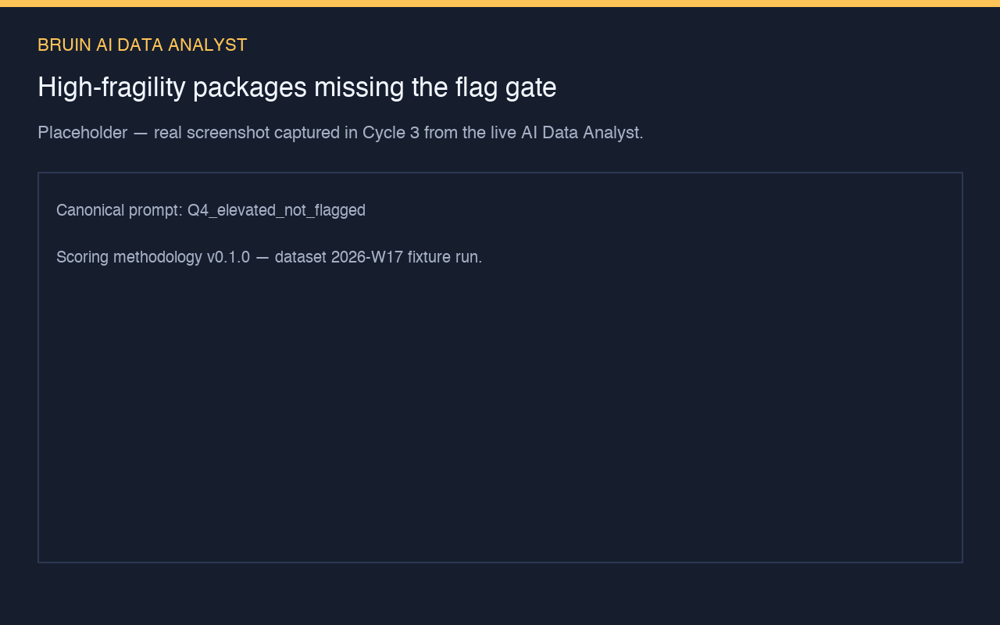

**Q5 — Which packages were excluded because they are archived or deprecated?**

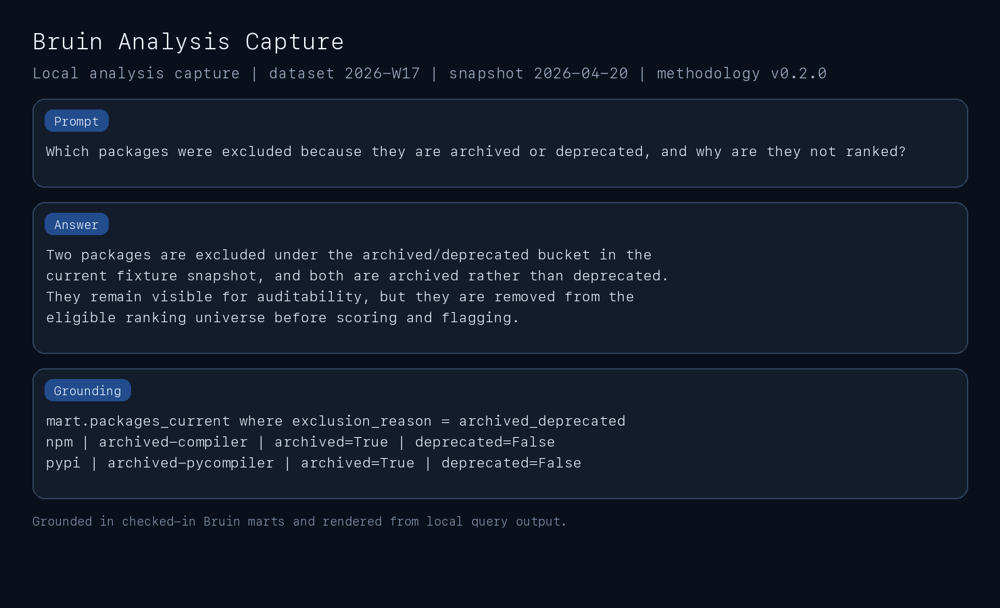

**Q6 — Which packages are excluded because their repository mapping confidence is too low?**

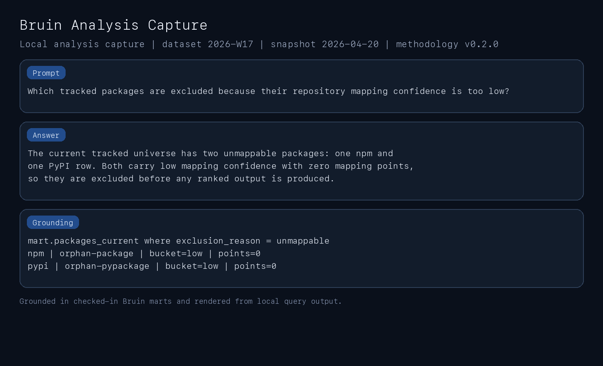

**Q7 — Compare the top flagged npm and PyPI packages by importance, fragility, confidence, and primary findings.**

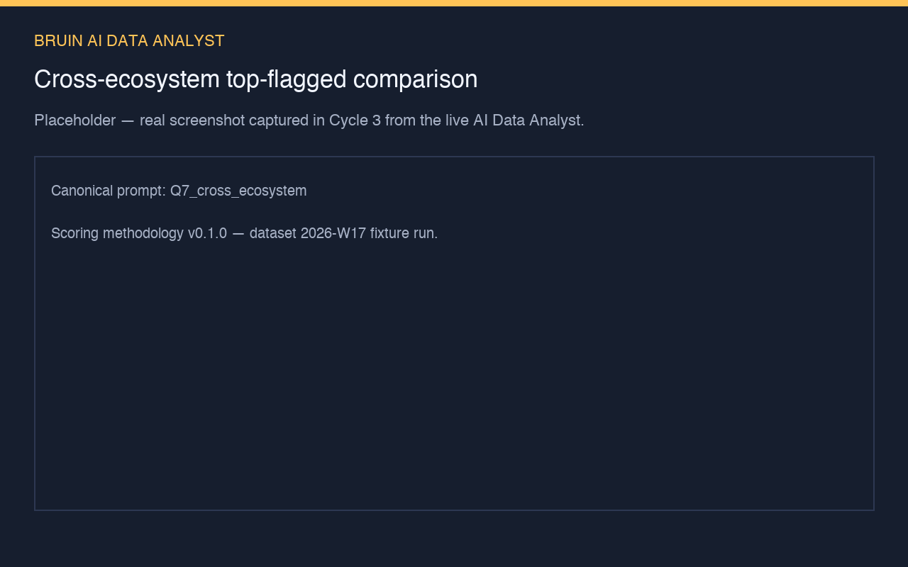

**Q8 — Which packages changed severity tier since the previous methodology-compatible snapshot?**

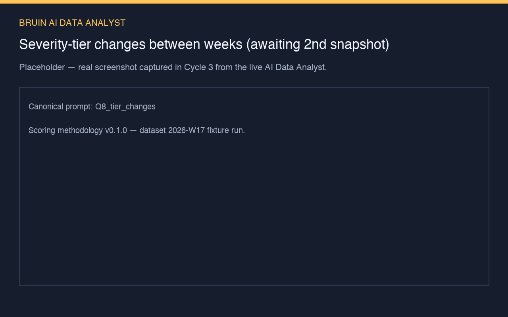

---

## How Bruin powers this

This project runs entirely on Bruin — one DAG from raw API calls to the published website.

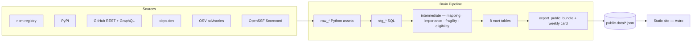

| Bruin feature | Where it shows up |
|---|---|
| **Python + SQL assets in one DAG** | Ingestion, scoring, JSON export, and Pillow share-card generation all live in the same graph |
| **DuckDB + BigQuery dual warehouse** | Same asset graph runs on a committed fixture (no keys needed) and on BigQuery live data — toggled by a single variable |
| **Seed assets** | 14 typed CSV fixtures with inline `not_null`, `unique`, and `accepted_values` checks |
| **Custom SQL checks** | Block downstream exports when fixture expectations drift — e.g. "no flagged package with low confidence" enforced at every run |
| **Variables** | `source_mode`, `snapshot_week`, package limits, and all 20+ scoring parameters are first-class Bruin variables — no hardcoded values |
| **`bruin ai enhance`** | Auto-generated mart column descriptions so the AI Data Analyst is grounded in real metadata, not guessing table semantics |
| **Lineage** | `bruin lineage` traces the full path from a raw API response to a published JSON file |
| **Scheduling** | Weekly cron declared in `pipeline.yml`; GitHub Actions hooks into the same entry point |

**Lineage proof** — `bruin lineage --full pipeline/assets/marts/export_public_bundle.py`:

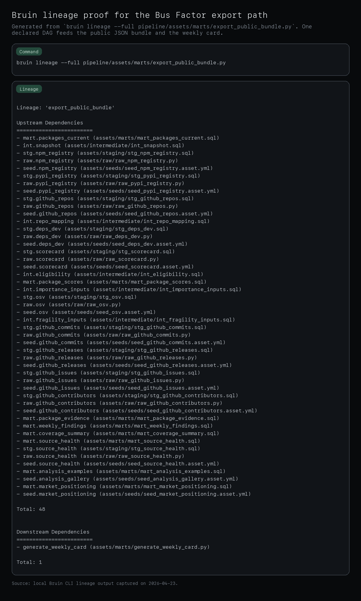

**Custom check failure proof** — an intentional known-state mismatch trips the check and blocks the export:

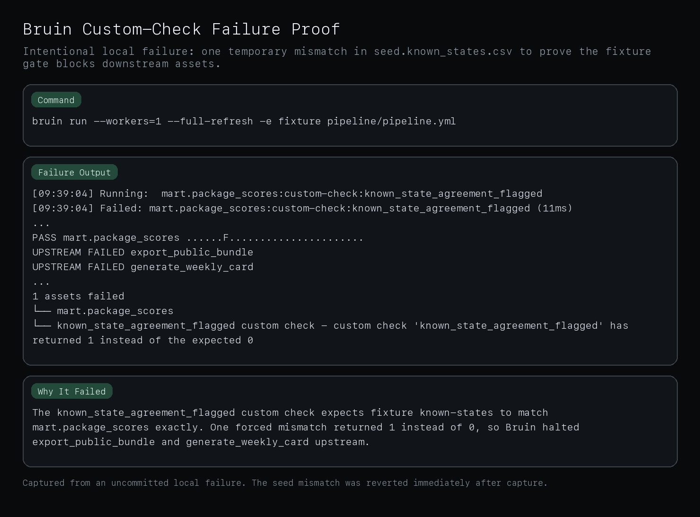

---

## What this is not

| Tool category | What they answer | What we answer |
|---|---|---|
| SCA tools (Snyk, Sonatype, Endor) | Is **my app** vulnerable? | Which widely used packages look structurally fragile **across the ecosystem**? |
| Malware scanners (Socket, Phylum) | Is **this version** malicious? | Not this. We never classify packages as malicious. |
| OpenSSF Scorecard | How does **this repo** score on best practices? | We consume Scorecard as one of six fragility inputs, weighted at 10%. |
| deps.dev | What depends on **X**? | We use the same data to compute importance. |

---

## Run it yourself

No API keys needed for the fixture run:

```bash
git clone https://github.com/josephwibowo/the-bus-factor
cd the-bus-factor
./scripts/setup.sh          # Bruin CLI + uv + pnpm

uv sync --locked
cp .bruin.yml.example .bruin.yml

bruin run --workers=1 --full-refresh -e fixture pipeline/pipeline.yml
```

The fixture run is fully deterministic. The same CSV fixtures always produce the same `public-data/` bundle and weekly card — no network calls, no credentials.

To run against live sources (requires GCP ADC and a GitHub token):

```bash
bruin run --workers=1 --full-refresh -e local_live_bq \
  --var 'source_mode="live"' \
  --var npm_package_limit=250 \
  --var pypi_package_limit=250 \
  pipeline/pipeline.yml
```

For deterministic replay, pass an ISO Monday reporting boundary through
`snapshot_week`, for example `--var 'snapshot_week="2026-04-20"'`. The weekly
GitHub Actions workflow exposes the same value as an optional manual-dispatch
input.

---

Built for the [Bruin Data Engineering Project Competition](https://getbruin.com/competition) · MIT License
